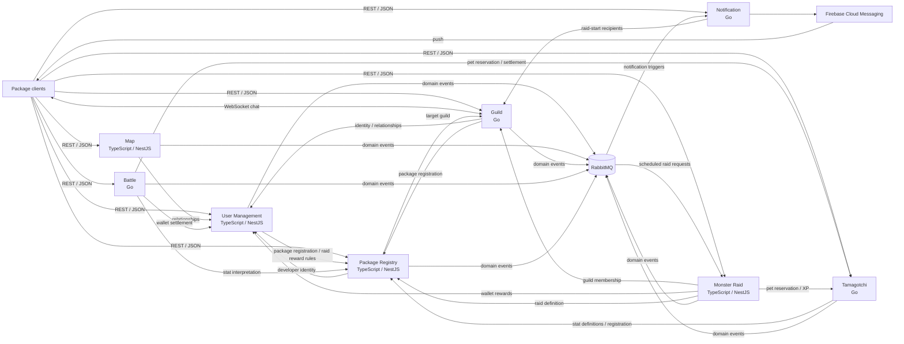

# Tamagotchi Go — PAD, Team 12

Lab 0 plans a microservice backend where independently developed pet-care apps share users, creatures, battles, guilds and raids. Each app (a **package**) can define its own care statistics; global services provide interoperability without forcing all packages to use the same hunger/happiness model.

**Status:** architecture and communication-contract proposal for implementation in later labs. The service allocation and technology split below are confirmed; the concrete gameplay constants and API design are the initial baseline for team review. Sava's Battle and Tamagotchi services are implemented for Lab 1 and runnable via [docker-compose.yml](docker-compose.yml) — see [Lab 1 — Running Sava's services](#lab-1--running-savas-services).

## Contents

- [Team and service boundaries](#team-and-service-boundaries)
- [Architecture](#architecture)
- [Technologies and trade-offs](#technologies-and-trade-offs)
- [Communication contract](#communication-contract)
- [Game rules and cross-service operations](#game-rules-and-cross-service-operations)
- [Contribution workflow](#contribution-workflow)
- [Lab 1 — Running Sava's services](#lab-1--running-savas-services)
- [Repository setup and Lab 0 checklist](#repository-setup-and-lab-0-checklist)

## Team and service boundaries

| Owner | Service | Sole responsibility / authoritative data | Does not own |
| --- | --- | --- | --- |
| Sava | **Battle** | PvP challenges/matches, immutable combat snapshots, battle turns, HP, actions, outcome and settlement progress | Persistent pet ownership/XP, wallets, package stat definitions |
| Sava | **Tamagotchi** | Pet identity, owner, originating package, six combat types, XP/level, sprites, package-specific care values, active pet selections and activity locks | Wallets, battle turns, package stat definitions |
| Vica | **Guild** | Guilds, membership, leader/officer/member roles, invitations, channels and persistent real-time chat | User identities/friendships, raid execution |
| Vica | **Notification** | Device registrations, notification inbox and Firebase delivery attempts/preferences | Business decisions about battle winners, friendships or guild membership |
| Mădălina | **User Management** | Accounts/authentication, profiles, directional enemy markers, friendships, global wallets and per-package local wallets, wallet operation ledger | Package registration authority, pet data, combat |
| Mădălina | **Map** | Latest non-stale location per user, proximity-pair state and nearby-user queries | Friendships, battle creation, notification delivery |
| Sabina | **Monster Raid** | Running raid instances, guild eligibility snapshot, participants, shared monster HP, accepted attacks, timers, reward settlement | Raid definitions/schedule, wallets, persistent pet progression |
| Sabina | **Package Registry** | Package metadata, developer/moderator membership, user-package registrations, versioned care-stat definitions, admin raid definitions and scheduling | User authentication/friendships, live pet values, running raid HP |

**Boundary decisions:** Package Registry is authoritative for user-package registrations; User Management can expose a read projection. Guild checks user identities and friendships through User Management and package eligibility through Package Registry. This resolves the topic's overlapping references to registration/identity. Local currency is recorded by User Management in separate package wallets; package-specific earning rules remain under that package's trusted backend. No client may directly award money or XP.

## Architecture



Every service has its **own PostgreSQL database and credentials**. Those eight databases are omitted above for readability. A shared PostgreSQL server is acceptable for local development; tables and credentials remain isolated. Client routing can initially use configured service URLs; a gateway can be added later without changing the contracts. Public and internal routes must be separated by network exposure and authorization.

| Caller / producer | Receiver | Purpose |
| --- | --- | --- |
| Clients | All public service APIs | REST commands and queries; user JWT |
| Clients | Guild | Authenticated WebSocket chat and REST history |
| Map | User Management | Filter friends/enemies and unrelated proximity candidates |
| User Management | Package Registry | Verify local-wallet registration and pinned raid reward rules |
| Package Registry | User Management, Guild | Validate developer identity and scheduled raid target guild |
| Notification | Guild | Resolve and persist the recipient set for raid-start notifications |
| Guild | User Management, Package Registry | Verify invitee identity, accepted friendship and shared package |
| Tamagotchi | Package Registry | Verify registration; retrieve immutable care rules and sprite configuration |
| Battle | Tamagotchi, Package Registry, User Management | Reserve pets, snapshot stats/rules, settle pet XP/transfer and global currency |
| Monster Raid | Guild, Tamagotchi, Package Registry, User Management | Check membership, reserve primary pets, read rules, settle rewards |
| Package Registry | RabbitMQ → Monster Raid | Activate/cancel a scheduled raid using a versioned definition |
| User Management, Map, Guild, Battle, Tamagotchi, Monster Raid | RabbitMQ → Notification | Persist and deliver targeted user notifications |

## Technologies and trade-offs

| Services | Language / framework | Storage | Transports |
| --- | --- | --- | --- |
| Battle, Tamagotchi | Go | PostgreSQL | REST/JSON, RabbitMQ |
| Guild, Notification | Go | PostgreSQL | REST/JSON, RabbitMQ; Guild WebSockets; Notification Firebase SDK |
| User Management, Map | TypeScript / NestJS | PostgreSQL; PostGIS extension for Map; Prisma ORM | REST/JSON, RabbitMQ |
| Monster Raid, Package Registry | TypeScript / NestJS | PostgreSQL; Prisma ORM | REST/JSON, RabbitMQ |

- **TypeScript / NestJS:** typed DTOs, validation and modules fit accounts, maps, raids and package configuration. Prisma simplifies PostgreSQL access across the four NestJS services. It needs more initial structure than a minimal HTTP library; runtime validation is still necessary because TypeScript types disappear at runtime.
- **Go:** single static binary, low memory/startup time and goroutines fit turn-based battle validation, concurrent pet reservation/settlement, guild chat fan-out and notification delivery. Explicit error handling and `database/sql` keep settlement logic auditable. Trade-off is more boilerplate than NestJS modules and a less batteries-included WebSocket/Firebase ecosystem, handled here with explicit reconnect/history and delivery-retry logic. Using exactly these two languages (Go + TypeScript, four services each) satisfies the course requirement against tooling overhead.
- **PostgreSQL:** transactions, unique constraints and row locking protect wallets, pet ownership and concurrent turns. Tamagotchi uses JSONB for different packages' care values, validated against Registry definitions. PostgreSQL per service simplifies tooling, but a single local server shares a failure domain.
- **PostGIS:** indexed geographic distance queries avoid scanning every location. This adds an extension to operate. The six-metre proximity threshold is a gameplay approximation, not a promise of GPS precision.
- **REST / JSON:** inspectable payloads, easy support in both stacks (Go and TypeScript) and immediate responses for turns and reads. More verbose than Protobuf; cross-service HTTP calls need bounded timeouts and cannot provide a distributed database transaction.
- **RabbitMQ:** durable asynchronous notification and scheduling events decouple producers from consumer availability. Adds broker operation, duplicate handling and eventual consistency. Critical reward settlement uses explicit idempotent APIs and a persisted coordinator rather than assuming event delivery is exactly once.
- **WebSockets:** required real-time guild chat without polling. Requires reconnect/history recovery and membership rechecks. Initial battles and raids use REST commands/polling; the assignment does not require a battle WebSocket.
- **Firebase Cloud Messaging:** fulfills the topic's push requirement. Requires a Firebase project, server credentials, client registration/permission and platform configuration (HTTPS and a service worker for web). A successful Firebase send is not proof that a user saw the message; the Notification inbox is durable.

## Communication contract

### Data management and common conventions

Each service is the only writer to its database. Cross-service IDs are references, not cross-database foreign keys. Reads go through the owner API; projections are explicitly non-authoritative. Amounts and XP use non-negative integer units. No floating-point money.

- Public paths start `/api/v1`; internal paths start `/internal/v1`. Each path belongs to the service under which it is listed. Internal routes are not public client APIs.
- Requests and responses are JSON (`application/json`), except `204` responses and WebSocket upgrades. Names are `snake_case`.
- Type notation below: `Id` = UUID string; `Time` = RFC 3339 UTC string; `Int` = signed 32-bit JSON integer; `Long` = JSON integer from 0 through 9,007,199,254,740,991; `Number` = finite JSON number; `Bool` = boolean; `T[]` = array; `T?` = optional field; `T | null` = required nullable field. Other fields are required. Definitions are schemas, not literal JSON.
- `Map<Number>` means an object with string keys and numeric values. For care statistics, keys, limits and interpretation come from the pet's pinned package definition. Unknown stat keys are rejected; global normalization is not performed.
- Public auth uses `Authorization: Bearer <JWT>`, issued by User Management. Validate signature, issuer, audience, expiry and subject locally using its JWKS endpoint. Access tokens last 15 minutes; hashed opaque refresh tokens last seven days and rotate on refresh. Admin status is provisioned administratively, never accepted from registration input. Guild/package roles come from their authoritative service.
- Internal requests use narrowly scoped service credentials. Forwarded user context must be signed/verified, never a freely supplied user-ID header. Authenticate both the service and the initiating user where an action is user-driven. Each endpoint still enforces its listed role.
- Mutating requests require `Idempotency-Key: <UUID>`. Scope keys to caller, method and path; store body hash and original result. Same key/body returns the original result after rechecking authorization; changed body returns `409`. Keep general keys 24 hours; business operation IDs for wallets, matches, raids and pet settlement remain with their ledger permanently. Retries outside the general window must first read resource state.
- Lists accept `limit: Int?` (default 20, range 1–100) and `cursor: string?`, ordered by creation time then ID unless specified. `Page<T> = {items: T[], next_cursor: string | null}`. Cursors are opaque and scoped to the query and caller. Empty lists return `200` with `items: []`.
- Internal calls time out after two seconds, with at most two retries with backoff for safe reads or commands retaining their original key. Unavailable dependencies yield `503`, not invented data or a successful reward. Persisted settlement workers may retry later with backoff and expose pending status.
- Shared errors: `400` malformed JSON, `401` unauthenticated, `403` forbidden, `404` missing resource, `409` state/version/idempotency conflict, `422` invalid field values, `429` throttled, `503` dependency unavailable. `429` and retryable `503` include `Retry-After` seconds. Endpoint tables describe success bodies; common errors apply as appropriate.

```text
Error = {code: string, message: string, request_id: Id,
         details: {field: string, reason: string}[]}
User = {user_id: Id, username: string, display_name: string}
Tokens = {access_token: string, refresh_token: string, token_type: "Bearer", expires_in: Int}
Operation = {operation_id: Id, status: "applied", applied_at: Time}
```

Example error (`409`):

```json
{"code":"PET_BUSY","message":"A selected pet is already reserved for another activity.","request_id":"451d407b-2468-4ab0-b164-09855ca01987","details":[]}
```

### User Management API

```text
Friendship = {friendship_id: Id, requester_id: Id, recipient_id: Id,
              status: "pending" | "accepted", created_at: Time}
Relationships = {user_id: Id, friend_ids: Id[], enemy_ids: Id[]}
Wallet = {user_id: Id, currency: "global" | "local", package_id: Id | null, balance: Long}
WalletEntry = {entry_id: Id, operation_id: Id, user_id: Id, currency: "global" | "local",
               package_id: Id | null, delta: Int, balance_after: Long, created_at: Time}
CurrencySettlement = {operation_id: Id, source_kind: "battle" | "raid", source_id: Id,
                      winner_id: Id | null, loser_id: Id | null, recipient_ids: Id[],
                      reward_per_recipient: Int, loser_penalty: Int,
                      rules_version: Int | null, definition_id: Id | null, definition_version: Int | null}
WalletResult = {operation: Operation, entries: WalletEntry[]}
```

| Method / path | Caller | Request / extra query | Success |
| --- | --- | --- | --- |
| `POST /api/v1/users` | Anonymous | `{username: string, email: string, password: string, display_name: string}` | `201 User`; unique username/email; hash password; never return it |
| `POST /api/v1/auth/login` | Anonymous | `{email: string, password: string}` | `200 Tokens` |
| `POST /api/v1/auth/refresh` | Refresh holder | `{refresh_token: string}` | `200 Tokens`; rotate token atomically |
| `POST /api/v1/auth/logout` | Refresh holder | `{refresh_token: string}` | `204`; revoke refresh session |
| `GET /api/v1/auth/jwks` | Public | None | `200 {keys: {kty: "RSA", kid: string, use: "sig", alg: "RS256", n: string, e: string}[]}`; public signing keys |
| `GET /api/v1/users/me` | User | None | `200 User` |
| `PATCH /api/v1/users/me` | User | `{display_name: string}` | `200 User` |
| `GET /api/v1/users/{user_id}` | User | None | `200 User`; public profile only |
| `POST /api/v1/friendships` | User | `{recipient_id: Id}` | `201 Friendship` pending; no self/duplicate requests |
| `PUT /api/v1/friendships/{friendship_id}/acceptance` | Recipient | `{}` | `200 Friendship` accepted |
| `DELETE /api/v1/friendships/{friendship_id}` | Either party | None | `204`; decline, cancel or unfriend |
| `GET /api/v1/friendships` | User | Pagination | `200 Page<Friendship>` involving caller |
| `PUT /api/v1/enemies/{user_id}` | User | `{}` | `200 Relationships`; directional marker, no self marker |
| `DELETE /api/v1/enemies/{user_id}` | User | None | `204` |
| `GET /api/v1/relationships` | User | None | `200 Relationships` for self |
| `GET /api/v1/wallets` | User | None | `200 {wallets: Wallet[]}` for self |
| `GET /api/v1/wallet-entries` | User | Pagination; `currency: "global" \| "local"?`, `package_id: Id?` | `200 Page<WalletEntry>` for self |
| `GET /internal/v1/users/{user_id}` | Guild, Registry, Battle, Map | None | `200 User` |
| `GET /internal/v1/users/{user_id}/relationships` | Map, Guild | None | `200 Relationships` |
| `POST /internal/v1/wallets/settlements` | Battle or Raid | `CurrencySettlement` | `200 WalletResult`; same operation is applied once |
| `POST /internal/v1/wallets/local-operations` | Trusted package backend | `{operation_id: Id, package_id: Id, user_id: Id, delta: Int, reason: string}` | `200 WalletResult`; caller bound to package and registered user; insufficient funds `409` |

Friends and enemies are mutually exclusive for a given user's view: marking an accepted friend as enemy requires removing the friendship first (`409` otherwise). Accepting a friendship while either side marks the other as enemy also returns `409`. Enemy marking is not a block and does not prevent combat. A global wallet starts at zero. A local wallet is lazily created after verifying Registry registration. For battle settlement, `recipient_ids` contains only `winner_id`, `rules_version` is 1 and definition fields are null; validate the version-1 constants below. For raids, winner/loser and rules_version are null, penalty is zero, and definition fields reference the immutable Registry reward policy. Only Battle can submit battle operations and only Raid can submit raid operations. Recipient IDs must be unique and authenticated coordinator input; ordinary users cannot call settlement. Atomically credit all recipients and debit `min(loser_balance, loser_penalty)`; balances never become negative. Unique `(source_kind, source_id)` prevents a second settlement even with a different operation ID.

### Tamagotchi API

```text
CombatType = "flame" | "nature" | "earth" | "electric" | "water" | "shadow"
Pet = {pet_id: Id, owner_id: Id, package_id: Id, name: string, type: CombatType,
       xp: Long, level: Int, sprite_urls: string[], definition_version: Int,
       care_stats: Map<Number>, version: Int, created_at: Time}
Selection = {user_id: Id, primary_pet_id: Id | null, secondary_pet_id: Id | null, version: Int}
ReservationRequest = {activity_id: Id, kind: "battle" | "raid",
                      participants: {user_id: Id, primary_pet_id: Id, secondary_pet_id: Id | null}[]}
Reservation = {reservation_id: Id, activity_id: Id, kind: "battle" | "raid",
               status: "reserved" | "committed" | "released", pets: Pet[]}
PetSettlement = {operation_id: Id, reservation_id: Id,
                 xp_awards: {pet_id: Id, amount: Int}[],
                 transfer: {pet_id: Id, from_user_id: Id, to_user_id: Id} | null}
PetSettlementResult = {operation: Operation, pets: Pet[], selections: Selection[]}
```

| Method / path | Caller | Request / extra query | Success |
| --- | --- | --- | --- |
| `POST /api/v1/tamagotchis` | Registered package user | `{package_id: Id, name: string, type: CombatType}` | `201 Pet`; one starter per `(user_id, package_id)`; initial stats/sprites from Registry |
| `GET /api/v1/tamagotchis` | User | Pagination; `owner_id: Id?` (defaults self) | `200 Page<Pet>`; another owner's view omits `care_stats` (see visibility below) |
| `GET /api/v1/tamagotchis/{pet_id}` | User | None | `200 Pet` for owner; otherwise `200 PetPublic` |
| `PATCH /api/v1/tamagotchis/{pet_id}` | Owner | `{name: string, expected_version: Int}` | `200 Pet`; no direct level/owner/type edits |
| `GET /api/v1/tamagotchi-selections/me` | User | None | `200 Selection` |
| `PUT /api/v1/tamagotchi-selections/me` | User | `{primary_pet_id: Id, secondary_pet_id: Id \| null, expected_version: Int}` | `200 Selection`; own distinct unlocked pets |
| `GET /api/v1/tamagotchi-types` | User | None | `200 {types: {type: CombatType, strong_against: CombatType, weak_against: CombatType}[]}` |
| `PUT /internal/v1/tamagotchis/{pet_id}/care-stats` | Pet's trusted package backend | `{care_stats: Map<Number>, expected_version: Int}` | `200 Pet`; complete validated replacement, version increment; busy pet `409` |
| `GET /internal/v1/tamagotchis/{pet_id}` | Battle, Raid | None | `200 Pet` |
| `POST /internal/v1/tamagotchi-reservations` | Battle, Raid | `ReservationRequest` | `201 Reservation`; validate and lock the whole requested set atomically |
| `GET /internal/v1/tamagotchi-reservations/{reservation_id}` | Creating service | None | `200 Reservation` |
| `POST /internal/v1/tamagotchi-reservations/{reservation_id}/release` | Creating service | `{}` | `200 Reservation`; release only an unsettled reservation |
| `POST /internal/v1/tamagotchi-settlements` | Reservation's creating service | `PetSettlement` | `200 PetSettlementResult`; awards/transfer/selection repair applied atomically |

`PetPublic` contains every `Pet` field **except** `care_stats`, `definition_version` and `version`. The list response is `Page<Pet>` for self and `Page<PetPublic>` for others; no mixed visibility. All pet names are 1–40 characters. New pets have XP 0 and level 1. Starter uniqueness still holds after losing/transferring that pet. A user without a primary can select another owned pet or create a starter from a different registered package; no replacement farming.

Selections reference existing pet IDs, never copies. A new first pet becomes primary. Secondary is optional for general care, but required for PvP; raids use only primary. Reservation verifies the submitted selection against the current stored selection, ownership, distinctness and lack of any other reservation. A PvP reservation covers both users and all four pets in one local transaction; raid reservations cover one participant at a time. Changing selection, care values or ownership for a reserved pet is blocked. Reservations are not silently expired: their owning coordinator explicitly settles/releases them and recovery reconciles unfinished activities.

Battle can request only battle-kind reservations, with exactly two distinct users/four distinct pets. Raid can request only raid-kind reservations, with one user/primary and secondary null. Enforce unique battle activity per creating service and unique raid `(activity_id, user_id)` reservation; identical business retries return the original reservation, conflicting participant sets return `409`. Lock rows in stable ID order. Release is idempotent: an already committed reservation is returned unchanged, never undone; settlement of a released reservation is a conflict. XP award pet IDs are unique and drawn from the reservation, with non-negative amounts. Battle awards cover all four pets; a rewarded raid covers its primary only. Trusted coordinators compute amounts; users cannot call these APIs. Increment optimistic versions on changed records.

Each reservation can be settled once; repeated identical operation returns the saved result, conflicting settlement returns `409`. XP applies to the snapshotted pet IDs before transfer. A battle transfer must be the loser's reserved primary to the winning participant; raid transfer must be null. The loser's remaining secondary becomes primary and their secondary reference clears. The winner keeps their existing selections and gains the captured pet as another owned pet. Commit releases all reservation locks atomically. XP is cumulative and level is `1 + floor(xp / 100)`.

### Battle API

```text
Loadout = {primary_pet_id: Id, secondary_pet_id: Id, boost: "none" | "guard" | "power"}
Fighter = {user_id: Id, loadout: Loadout, hp: Int, max_hp: Int,
           primary_level: Int, secondary_level: Int, primary_type: CombatType,
           care_bonus: Number, defense_active: Bool, power_pending: Bool, boost_used: Bool}
Battle = {battle_id: Id, challenger_id: Id, opponent_id: Id,
          state: "pending" | "preparing" | "active" | "settling" | "completed" | "declined" | "cancelled" | "expired",
          fighters: Fighter[], turn_user_id: Id | null, turn_number: Int, version: Int,
          winner_id: Id | null, rules_version: Int, created_at: Time, expires_at: Time,
          turn_deadline: Time | null, reservation_id: Id | null,
          settlement: {pets: "pending" | "applied", currency: "pending" | "applied"} | null}
BattleAction = {action_id: Id, battle_id: Id, actor_id: Id, turn_number: Int,
                action: "attack" | "defend" | "boost" | "surrender", damage: Int, created_at: Time}
ActionResult = {action: BattleAction, battle: Battle}
BattleRules = {version: Int, winner_currency: Int, loser_penalty: Int,
               winner_xp: Int, loser_xp: Int, primary_xp_percent: Int,
               turn_seconds: Int, challenge_seconds: Int, max_turns: Int}
```

| Method / path | Caller | Request / extra query | Success |
| --- | --- | --- | --- |
| `GET /api/v1/battle-rules` | User | None | `200 BattleRules`; version 1 is defined below |
| `POST /api/v1/battles` | User | `{opponent_id: Id, loadout: Loadout}` | `201 Battle` pending; no self challenge; opponent exists |
| `GET /api/v1/battles` | User | Pagination; `state: string?` (Battle state enum) | `200 Page<Battle>` involving caller |
| `GET /api/v1/battles/{battle_id}` | Participant | None | `200 Battle` |
| `POST /api/v1/battles/{battle_id}/accept` | Opponent | `{loadout: Loadout}` | `202 Battle` preparing; client polls until active/cancelled |
| `POST /api/v1/battles/{battle_id}/decline` | Opponent | `{}` | `200 Battle` declined; pending only |
| `POST /api/v1/battles/{battle_id}/cancel` | Challenger | `{}` | `200 Battle` cancelled; pending only |
| `POST /api/v1/battles/{battle_id}/actions` | Participant | `{action: "attack" \| "defend" \| "boost" \| "surrender", expected_version: Int}` | `201 ActionResult`; turn/version checked atomically |
| `GET /api/v1/battles/{battle_id}/actions` | Participant | Pagination | `200 Page<BattleAction>` ordered by turn then action ID |

The Battle Service also owns lightweight challenge creation/matching because the topic defines no separate matchmaking service. One preparing/active/settling battle per user; multiple pending invitations do not reserve pets. Pending `fighters` is empty: loadouts remain private until both players accept and snapshots are created. Accept atomically moves to preparing; a persisted worker obtains the reservation, retrieves the exact Registry definition versions and creates fighters. Preparation validation failure cancels the battle and releases any reservation; temporary dependency failure remains preparing for retry. Pending challenges expire after 120 seconds. Both users must have a primary and secondary; selection is rechecked at reservation time.

### Guild API and chat

```text
Guild = {guild_id: Id, name: string, leader_id: Id, created_at: Time}
Member = {guild_id: Id, user_id: Id, role: "leader" | "officer" | "member", joined_at: Time}
GuildInvite = {invite_id: Id, guild_id: Id, inviter_id: Id, invitee_id: Id,
               state: "pending" | "accepted" | "declined" | "cancelled", created_at: Time}
Message = {message_id: Id, client_message_id: Id, guild_id: Id,
           author_id: Id, text: string, sent_at: Time}
```

| Method / path | Caller | Request / extra query | Success |
| --- | --- | --- | --- |
| `POST /api/v1/guilds` | User without guild | `{name: string}` | `201 Guild`; caller becomes leader |
| `GET /api/v1/guilds` | User | Pagination | `200 Page<Guild>`; guild directory |
| `GET /api/v1/guilds/{guild_id}` | User | None | `200 Guild` |
| `PATCH /api/v1/guilds/{guild_id}` | Leader | `{name: string}` | `200 Guild` |
| `GET /api/v1/guilds/{guild_id}/members` | Member | Pagination | `200 Page<Member>` |
| `POST /api/v1/guilds/{guild_id}/invites` | Leader/officer | `{invitee_id: Id}` | `201 GuildInvite`; accepted friend of inviter, at least one shared package |
| `GET /api/v1/guild-invites` | User | Pagination | `200 Page<GuildInvite>` addressed to caller |
| `POST /api/v1/guild-invites/{invite_id}/accept` | Invitee | `{}` | `200 Member`; pending invite and no existing guild; recheck eligibility |
| `POST /api/v1/guild-invites/{invite_id}/decline` | Invitee | `{}` | `200 GuildInvite` declined |
| `DELETE /api/v1/guild-invites/{invite_id}` | Leader or inviter | None | `204`; cancel pending invite |
| `PATCH /api/v1/guilds/{guild_id}/members/{user_id}` | Leader | `{role: "officer" \| "member"}` | `200 Member`; cannot demote self |
| `POST /api/v1/guilds/{guild_id}/leadership` | Leader | `{new_leader_id: Id}` | `200 Guild`; atomically transfer to existing member, former leader becomes officer |
| `DELETE /api/v1/guilds/{guild_id}/members/{user_id}` | Self, or leader removing another member | None | `204`; leader must transfer or disband first |
| `DELETE /api/v1/guilds/{guild_id}` | Leader | None | `204`; disband and close chat; historical raid snapshots survive |
| `GET /api/v1/guilds/{guild_id}/messages` | Member | Pagination; `after_message_id: Id?` for reconnect | `200 Page<Message>` chronological; cursor and after-ID mutually exclusive |
| `POST /api/v1/guilds/{guild_id}/chat-tickets` | Member | `{}` | `201 {ticket: string, expires_at: Time}`; single-use, 30 seconds |
| `GET /api/v1/guilds/{guild_id}/ws` | Ticket holder | Query `ticket: string` | `101` WebSocket upgrade |
| `GET /internal/v1/guilds/{guild_id}/members/{user_id}` | Raid | None | `200 Member`; absent membership `404` |
| `GET /internal/v1/guilds/{guild_id}` | Registry, Raid | None | `200 Guild`; verify target guild exists |

One guild per user; unique case-insensitive guild name, 3–50 characters, at most 100 members (acceptance beyond capacity returns `409`). A guild has exactly one leader. Channel is the guild itself for Lab 0's initial design. Socket messages use JSON:

| Direction / type | Fields | Result |
| --- | --- | --- |
| Client `chat.send` | `{type: "chat.send", client_message_id: Id, text: string}` | Text 1–2000 characters; guild and author derived from verified connection |
| Server `chat.ack` | `{type: "chat.ack", client_message_id: Id, message_id: Id}` | Sent only after persistence |
| Server `chat.message` | `{type: "chat.message", message: Message}` | Broadcast to current guild members |
| Server `chat.error` | `{type: "chat.error", client_message_id: Id \| null, error: Error}` | No message broadcast on failure |

Unique `(author_id, client_message_id)` prevents duplicate sends; different text with reused ID is a conflict. Recheck membership on every send and before delivery; removal/disband closes access immediately. Heartbeat every 30 seconds; two missed pong responses close the socket. Auth expiry closes with `1008`, normal closure uses `1000`. Reconnect with a new ticket and REST `after_message_id`; deleted/nonexistent anchor returns `404`, never silently skips history. Redact ticket query strings from logs. Multi-instance deployment will need per-instance fan-out so every connected member receives persisted messages.

### Notification API

```text
Device = {device_id: Id, platform: "web" | "android" | "ios", created_at: Time}
Preferences = {push_enabled: Bool, disabled_types: string[]}
Notification = {notification_id: Id, type: string, title: string, body: string,
                resource_type: string, resource_id: Id, read_at: Time | null, created_at: Time}
```

| Method / path | Caller | Request / extra query | Success |
| --- | --- | --- | --- |
| `POST /api/v1/notification-devices` | User | `{firebase_token: string, platform: "web" \| "android" \| "ios"}` | `201 Device`; unique active token, bind/rebind to authenticated user |
| `DELETE /api/v1/notification-devices/{device_id}` | Device owner | None | `204` |
| `GET /api/v1/notification-preferences` | User | None | `200 Preferences` |
| `PUT /api/v1/notification-preferences` | User | `Preferences` | `200 Preferences`; disabled types must be listed notification event names |
| `GET /api/v1/notifications` | User | Pagination; `unread: Bool?` | `200 Page<Notification>` for self |
| `PUT /api/v1/notifications/{notification_id}/read` | Recipient | `{}` | `200 Notification` |

No public endpoint allows sending notifications to arbitrary users. Event handling creates one inbox entry per `(event_id, recipient_id)` and separate per-device delivery jobs. Preferences suppress push, not inbox persistence. Invalid Firebase tokens are removed; transient sends retry with bounded backoff, then become failed delivery jobs. FCM payload is `{data: {notification_id: string, type: string, resource_type: string, resource_id: string}}`; clients fetch authorized content from the inbox. Duplicate push delivery is possible, so clients deduplicate by notification ID. Raw coordinates, care stats and credentials are excluded from push payloads.

### Map API

```text
Location = {latitude: Number, longitude: Number, accuracy_m: Number, recorded_at: Time}
LocatedUser = {user: User, latitude: Number, longitude: Number, accuracy_m: Number,
               recorded_at: Time, distance_m: Number | null, relationship: "friend" | "enemy" | "unknown"}
```

| Method / path | Caller | Request / extra query | Success |
| --- | --- | --- | --- |
| `PUT /api/v1/map/location` | User | `Location` | `200 {accepted: Bool, location: Location}`; stale update returns false and retained location |
| `GET /api/v1/map/users` | User | None | `200 {users: LocatedUser[], generated_at: Time}`; latest visible users |
| `DELETE /api/v1/map/location` | User | None | `204`; stop sharing and clear current proximity memberships |

Latitude is −90..90, longitude −180..180, accuracy is positive. Accept only strictly newer updates, at most 30 seconds in the future and 120 seconds old. Invalid time/coordinates return `422`. Locations become stale after 120 seconds and are omitted, including friends/enemies. "Always visible" means no distance cutoff for friends/enemies with a fresh shared location, not fabricated or indefinitely retained coordinates. Friends/enemies can still be returned if the caller has no fresh location; their `distance_m` is then null. Unknown users require fresh locations for both parties and distance ≤6 m. Return at most 500 users, prioritizing relationships then nearest strangers; an implementation needing more must version this contract with map tiling/pagination.

For fresh unrelated users, emit one `UsersNearby` per proximity entry, addressed to both. Use canonical sorted pair IDs and an atomic pair-state update to prevent simultaneous updates generating duplicates. Re-arm only after distance >10 m or a location becomes stale/deleted, with a 60-second notification cooldown. Map never creates a friendship or battle itself.

### Monster Raid API

```text
Raid = {raid_id: Id, schedule_id: Id, definition_id: Id, definition_version: Int, guild_id: Id,
        state: "active" | "settling" | "completed" | "failed" | "cancelled",
        hp: Long, max_hp: Long, starts_at: Time, ends_at: Time, participant_limit: Int,
        version: Int, settlement_pending: Int}
RaidParticipant = {raid_id: Id, user_id: Id, pet_id: Id, reservation_id: Id,
                   damage: Long, joined_at: Time, reward_status: "pending" | "applied" | "ineligible"}
RaidAttack = {attack_id: Id, raid_id: Id, user_id: Id, damage: Int, remaining_hp: Long, created_at: Time}
```

| Method / path | Caller | Request / extra query | Success |
| --- | --- | --- | --- |
| `GET /api/v1/raids` | User | Pagination; `guild_id: Id` | `200 Page<Raid>`; must be current guild member |
| `GET /api/v1/raids/{raid_id}` | Current guild member or recorded participant | None | `200 Raid` |
| `POST /api/v1/raids/{raid_id}/participants` | Current guild member | `{primary_pet_id: Id}` | `201 RaidParticipant`; reserve selected primary and verify capacity |
| `GET /api/v1/raids/{raid_id}/participants` | Current guild member or participant | Pagination | `200 Page<RaidParticipant>` |
| `POST /api/v1/raids/{raid_id}/attacks` | Participant who remains a guild member | `{}` | `201 RaidAttack`; max one accepted attack per second per user, otherwise `429` |
| `GET /internal/v1/raids/by-schedule/{schedule_id}` | Registry | None | `200 Raid`; not yet consumed `404` |

An activation event creates exactly one raid per schedule ID; the target guild must exist. The scheduled start time and duration determine the deadline, not delivery time. An activation received after its deadline creates a failed raid. A cancellation arriving first leaves a schedule tombstone so later activation cannot resurrect it. Join uses a persisted join attempt and idempotent pet reservation; if capacity/lifecycle checks fail after reservation, release it. Attacks use a per-raid lock/atomic HP update, server timestamp and unique request ID; HP cannot drop below zero. The transaction that kills the monster also chooses settlement, preventing timer/cancel races from settling twice.

Guild membership is checked on joining and attacking. Leaving/kicking prevents further attacks, but historical contributions and earned rewards remain. Disbanded guild membership checks prevent further joins/attacks; the timer eventually fails the raid if it cannot complete. No duplicate participation; a pet cannot simultaneously raid or battle.

### Package Registry API

```text
StatRule = {key: string, min: Number, max: Number, initial: Number,
            bonus_when: "gte" | "lte", threshold: Number, combat_bonus: Number}
CareDefinition = {package_id: Id, version: Int, stats: StatRule[], sprite_urls: string[], created_at: Time}
Package = {package_id: Id, name: string, app_version: string, description: string,
           status: "active" | "inactive", developer_id: Id, current_definition_version: Int}
PackageMember = {package_id: Id, user_id: Id, role: "developer" | "moderator"}
Registration = {package_id: Id, user_id: Id, registered_at: Time}
Monster = {name: string, description: string, sprite_urls: string[], max_hp: Long,
           attack: Int, defense: Int, weak_to: CombatType[], resistant_to: CombatType[],
           special: "none" | "armored"}
RaidDefinition = {definition_id: Id, version: Int, monster: Monster, duration_seconds: Int,
                  participant_limit: Int, currency_reward: Int, xp_reward: Int, created_at: Time}
RaidSchedule = {schedule_id: Id, definition_id: Id, definition_version: Int, guild_id: Id,
                starts_at: Time, state: "scheduled" | "activated" | "cancelled", revision: Int}
```

| Method / path | Caller | Request / extra query | Success |
| --- | --- | --- | --- |
| `POST /api/v1/packages` | Global admin | `{name: string, app_version: string, description: string, developer_id: Id, stats: StatRule[], sprite_urls: string[]}` | `201 Package`; definition version 1; developer must exist |
| `GET /api/v1/packages` | User | Pagination | `200 Page<Package>`; active only for ordinary users |
| `GET /api/v1/packages/{package_id}` | User | None | `200 Package`; inactive accessible to registered users/staff/admin |
| `PATCH /api/v1/packages/{package_id}` | Developer or admin | `{app_version: string?, description: string?, status: "active" \| "inactive"?}` | `200 Package`; at least one field |
| `GET /api/v1/packages/{package_id}/staff` | Package staff/admin | None | `200 {members: PackageMember[]}` |
| `PUT /api/v1/packages/{package_id}/moderators/{user_id}` | Developer/admin | `{}` | `200 PackageMember`; role moderator |
| `DELETE /api/v1/packages/{package_id}/moderators/{user_id}` | Developer/admin | None | `204`; cannot remove developer |
| `POST /api/v1/packages/{package_id}/care-definitions` | Package staff/admin | `{stats: StatRule[], sprite_urls: string[]}` | `201 CareDefinition`; next immutable version |
| `GET /api/v1/packages/{package_id}/care-definitions/{version}` | Registered user, staff/admin | None | `200 CareDefinition` |
| `POST /api/v1/packages/{package_id}/registrations` | User | `{}` | `201 Registration`; active package only, unique membership |
| `GET /api/v1/package-registrations/me` | User | None | `200 {registrations: Registration[]}` |
| `GET /internal/v1/users/{user_id}/package-registrations` | Guild, User Management, Tamagotchi | None | `200 {registrations: Registration[]}` |
| `GET /internal/v1/packages/{package_id}/care-definitions/{version}` | Tamagotchi, Battle, Raid | None | `200 CareDefinition`; immutable versions available even if inactive |
| `GET /internal/v1/packages/{package_id}` | Tamagotchi | None | `200 Package` |
| `POST /api/v1/raid-definitions` | Global admin | `{monster: Monster, duration_seconds: Int, participant_limit: Int, currency_reward: Int, xp_reward: Int}` | `201 RaidDefinition` version 1 |
| `POST /api/v1/raid-definitions/{definition_id}/versions` | Global admin | Same body as creation | `201 RaidDefinition`; new immutable version |
| `GET /api/v1/raid-definitions` | Global admin | Pagination | `200 Page<RaidDefinition>` latest versions |
| `GET /api/v1/raid-definitions/{definition_id}/versions/{version}` | Global admin | None | `200 RaidDefinition` |
| `POST /api/v1/raid-schedules` | Global admin | `{definition_id: Id, definition_version: Int, guild_id: Id, starts_at: Time}` | `201 RaidSchedule` scheduled |
| `GET /api/v1/raid-schedules` | Global admin | Pagination | `200 Page<RaidSchedule>` |
| `POST /api/v1/raid-schedules/{schedule_id}/activate` | Global admin | `{}` | `202 RaidSchedule` activated; set start to now and enqueue request atomically |
| `POST /api/v1/raid-schedules/{schedule_id}/cancel` | Global admin | `{}` | `202 RaidSchedule` cancelled; emit cancellation; terminal raid outcomes are retained |
| `GET /internal/v1/raid-definitions/{definition_id}/versions/{version}` | Raid, User Management | None | `200 RaidDefinition` |

Definitions are immutable. Pets pin their creation version; updating a package affects new pets only until an explicit migration is designed. Require unique stat keys (1–32 stats), `min <= initial <= max`, threshold in range and bonus 0..0.10. Care bonuses sum and cap at 0.20. Sprite URLs must be HTTPS. No arbitrary scripts or formulas are executed from package configuration. Package staff assignment is distinct from global admin permission.

Monster HP must be positive; damage/defense/rewards non-negative; weaknesses and resistances must be disjoint. Duration is 60–86400 seconds and participant limit 1–100. Schedules reference an exact definition version. A persisted scheduler activates due schedules using a compare-and-set transition and an outbox, just like manual activation. Cancellation is the initial design's deactivation mechanism: stop a scheduled/active raid; reactivation requires a new schedule ID. Admin cancellation after the raid's terminal transaction does not undo rewards. Registry reports command state; Raid reports execution state.

### Asynchronous event contract

RabbitMQ uses a durable topic exchange `tamagotchi.events.v1`, persistent JSON messages, publisher confirms and manual acknowledgements. Each subscribing service has its own durable queue; replicas of that service compete on that queue. Transactional outbox rows are committed with business state. Consumers save inbox deduplication and their local effects in one transaction before acknowledging. Publisher retries retain the same event ID.

```text
Event<T> = {event_id: Id, type: string, version: Int, producer: string,
            occurred_at: Time, correlation_id: Id, payload: T}
FriendRequested = {friendship_id: Id, requester_id: Id, recipient_id: Id}
UsersNearby = {encounter_id: Id, user_ids: Id[]}
GuildInvited = {invite_id: Id, guild_id: Id, inviter_id: Id, invitee_id: Id}
BattleRequested = {battle_id: Id, challenger_id: Id, opponent_id: Id}
BattleCompleted = {battle_id: Id, winner_id: Id, loser_id: Id, captured_pet_id: Id}
PetActivityStarted = {activity_id: Id, kind: "battle" | "raid", owner_ids: Id[], pet_ids: Id[]}
PetTransferred = {operation_id: Id, pet_id: Id, previous_owner_id: Id, new_owner_id: Id}
RaidActivationRequested = {schedule_id: Id, revision: Int, definition_id: Id,
                          definition_version: Int, guild_id: Id, starts_at: Time}
RaidCancellationRequested = {schedule_id: Id, revision: Int}
RaidStarted = {raid_id: Id, guild_id: Id, ends_at: Time}
RaidFinished = {raid_id: Id, guild_id: Id, state: "completed" | "failed" | "cancelled", participant_ids: Id[]}
```

| Type / routing key | Producer | Consumer queue | Notification recipient / effect |
| --- | --- | --- | --- |
| `FriendRequested` / `friend.requested` | User Management | `notification.events.v1` | Recipient |
| `UsersNearby` / `users.nearby` | Map | `notification.events.v1` | Exactly the two distinct sorted user IDs |
| `GuildInvited` / `guild.invited` | Guild | `notification.events.v1` | Invitee |
| `BattleRequested` / `battle.requested` | Battle | `notification.events.v1` | Opponent |
| `BattleCompleted` / `battle.completed` | Battle | `notification.events.v1` | Winner and loser; only after settlement |
| `PetActivityStarted` / `pet.activity-started` | Tamagotchi | `notification.events.v1` | Distinct pet owners; reservation successfully committed |
| `PetTransferred` / `pet.transferred` | Tamagotchi | `notification.events.v1` | Previous and new owner |
| `RaidActivationRequested` / `raid.activation-requested` | Registry | `raid.scheduling.v1` | Create a raid once per schedule |
| `RaidCancellationRequested` / `raid.cancellation-requested` | Registry | `raid.scheduling.v1` | Record tombstone or cancel active raid and release pets |
| `RaidStarted` / `raid.started` | Raid | `notification.events.v1` | Guild member snapshot resolved through Guild (internal API below) |
| `RaidFinished` / `raid.finished` | Raid | `notification.events.v1` | Recorded participants |

Additional internal endpoint owned by Guild: `GET /internal/v1/guilds/{guild_id}/members`, authorized to Notification, returns `200 {members: Member[]}`. Guilds are capped at 100 members, making this a bounded response. Resolve `RaidStarted` recipients once when processing the event and persist that recipient set; if the guild no longer exists, record the event as handled with no recipients. Dependency outages retry rather than treating membership as empty.

`version` is 1. `correlation_id` is the principal resource ID (battle, raid, schedule, friendship, encounter, invite or pet activity/operation). Producer and type must match the table; consumers reject invalid schemas/IDs. Exchange permissions limit publishers and subscriptions. New optional fields are backward-compatible; changed semantics/removed fields require a new major event version. Schema-invalid or conflicting messages go to the consumer's dead-letter queue. Transient failures retry after 1, 5 and 30 seconds, then go to `<queue>.dlq` for inspection/replay with unchanged IDs. Business IDs also deduplicate where a duplicate event could be generated with a new event ID. Delivery order is not assumed; schedule revisions/tombstones handle cancellation before activation.

Example:

Wire `producer` identifiers are `user-management`, `map`, `guild`, `battle`, `tamagotchi`, `monster-raid` and `package-registry`, corresponding to the service names in the table.

```json
{
  "event_id": "cc4e4480-c668-4e34-a33e-8b28d879c99b",
  "type": "BattleRequested",
  "version": 1,
  "producer": "battle",
  "occurred_at": "2026-09-10T15:00:00Z",
  "correlation_id": "d50656a4-6dcf-4a8e-97fa-c0f42e2143ca",
  "payload": {
    "battle_id": "d50656a4-6dcf-4a8e-97fa-c0f42e2143ca",
    "challenger_id": "e0aa61e2-1c9b-4ec2-9bb2-f1284b2d29a0",
    "opponent_id": "9e8ea0a3-d10e-45ec-ade4-c2a66032f541"
  }
}
```

## Game rules and cross-service operations

### PvP rules — initial version 1

- Six-type cycle: **flame → nature → earth → electric → water → shadow → flame**. An arrow means 1.5× damage; the reverse matchup gives 0.75×; identical or other pairs give 1×. Only the primary's type determines the matchup.
- Each fighter selects two distinct owned pets and one free, match-local boost (`none`, `guard` or `power`). Boosts are not persistent inventory in this baseline.
- Starting HP: `100 + 10 × primary_level + 5 × secondary_level`.
- Care bonus: for each selected pet, sum the bonuses of satisfied package-specific thresholds and cap at 0.20; the fighter's bonus is the mean of those two bonuses. Each pet uses its own pinned definition; missing/invalid definitions prevent battle preparation.
- Attack damage: `max(1, floor((10 + 2 × primary_level + secondary_level) × type_multiplier × (1 + care_bonus) × power_multiplier × defense_multiplier))`. Power multiplier is 1.5 for the next attack after a power boost, otherwise 1. Defense multiplier is 0.5 for the next received attack after defend/guard, otherwise 1. Effects do not stack and are consumed on that attack.
- `defend` sets defense active and consumes the turn. `boost` applies the selected power/guard once per match and consumes the turn; `none` or a used boost returns `409`. `attack` consumes the turn. `surrender` may be submitted by either participant at any time while active and immediately loses.
- Challenger moves first. One action per turn, enforced with `expected_version` and a row lock. Each turn lasts 30 seconds; timeout forfeits. At 100 accepted turns, the fighter with greater remaining HP proportion wins; an exact tie goes to the opponent (second mover). Server timers and actions use the same state lock.
- Winner gets **50 global currency, 100 pet XP and the loser's primary pet**. Loser loses up to **20 global currency** and receives **40 pet XP**. Split each player's XP 60% to primary (floor) and remainder to secondary using the pre-transfer pet IDs.

### Battle settlement and recovery

1. Persist the terminal outcome and intended rewards; transition active → settling. No more turns are accepted.
2. Call Tamagotchi settlement using a stable operation ID derived/persisted for the battle. Apply both players' pet XP, transfer the loser's primary, repair selections and release all pet locks in one local transaction.
3. Call User Management settlement with the battle ID and a stable operation ID. Credits/debit happen atomically in its database.
4. Persist each acknowledgement, then transition to completed and emit `BattleCompleted` from the outbox. Retries after lost responses reuse the operation IDs and bodies.

This is a **roll-forward saga**, not a distributed transaction. After pet settlement succeeds, transient wallet failure leaves the battle visibly settling; do not reverse a transfer that may already have subsequent history. The coordinator resumes after restart. Unique reservation/source IDs prevent duplicate XP, transfers or currency even when a caller retries with a new transport key. Preparing failures release reservations; a settling activity is never cancelled to bypass unfinished rewards.

### Raid rules and settlement

Raid attack damage is `max(1, floor((10 + 2 × primary_level) × type_multiplier × (1 + care_bonus)) - defense)`, with 1.5× for configured weakness, 0.75× for resistance and 1× otherwise. `armored` doubles defense. The primary's pinned care bonus is capped at 0.20. Monster `attack` is stored combat metadata reserved for later counterattack mechanics; version 1 is a clicker with no pet HP loss or equipped boosts. XP levels and damage are server-computed from the reserved snapshot.

On victory, every participant with at least one accepted damaging attack receives the definition's currency and XP reward. Total applied damage is capped at remaining HP. XP goes entirely to the reserved primary. A timer expiry or admin cancellation gives no rewards. Always release reservations for ineligible participants and unsuccessful raids. For successful raids, persist per-participant pet settlement operations and one batch wallet operation keyed by raid ID; retry until all apply, then complete and emit `RaidFinished`. Failure/cancellation similarly emits the terminal event after reservation cleanup. The terminal decision is immutable even when cancellation and the final attack race.

### Review scenarios for implementation

- Retry a battle action after a lost response; exactly one turn/damage application.
- Accept two battles or join a raid with the same pet concurrently; one reservation succeeds.
- Deliver reward commands/events twice; no duplicate currency, XP or captured pet.
- Crash between pet transfer and wallet credit; battle resumes in settling and completes once.
- Use two packages with different care keys and reversed healthy directions; bonuses follow each pinned definition.
- Reject forged owner/user IDs and care/XP updates from untrusted clients.
- Race final raid attack, deadline and cancellation; only one terminal outcome and one reward batch.
- Deliver schedule cancellation before activation; raid never starts afterwards.
- Send stale positions or simultaneous proximity updates; no incorrect location rollback or duplicate encounter event.
- Remove a guild member during chat; future reads/sends/delivery denied, reconnect recovers only authorized history.

## Contribution workflow

This section defines the team policy. **Documented rules are not proof that GitHub enforcement is enabled**; owner actions are tracked in [the setup checklist](docs/lab-0-checklist.md).

- `main`: presentation-ready milestones. `dev`: integration. Both are permanent.
- Create task branches from updated `dev`: `<type>/<short-kebab-description>` with an optional `lab-<number>/` segment (for example `<type>/lab-0/<short-kebab-description>`), where type is `feat`, `fix`, `docs`, `test`, `refactor` or `chore`.
- Use Conventional Commits: `docs(battle): define combat contracts`, `chore(submodules): link tamagotchi service`. Write your own contributions from your own account; review shared contracts with the service owners.
- Task PRs target `dev`, use the [PR template](.github/pull_request_template.md), pass **PR policy**, and receive **one teammate approval** on the latest changes. Resolve review discussions before merging. Any changed cross-service contract needs review by an affected owner.
- Squash task PRs into `dev`, then delete the task branch. Release PRs go **`dev` → `main` using a merge commit**, preserving the shared ancestry of the long-lived branches. Do not squash/rebase repeated releases between those branches.
- Protect `main` and `dev`: require PRs, one approval, dismiss stale approvals, resolve conversations and require the `PR policy` check. Block force pushes/deletion. Do not require linear history on `main`, because milestone merges use merge commits. Avoid administrator bypass.
- Bootstrap exception: an empty repository needs one initial setup commit to establish `main`/`dev`. Any subsequent unreviewed bootstrap merge must be explicitly recorded in the PR; it is not the normal contribution workflow.
- PR title: `<type>(<scope>): <imperative summary>`. Description: **Summary**, **Verification**, **Contract impact**, **Checklist**. Explain checks performed; do not claim tests ran when only docs changed.
- Lab 0 verification is documentation/contract review, link checks and PR-policy CI. There is no runnable-service coverage claim. During implementation, target **80% line coverage for business logic**, plus mandatory tests for wallet/pet settlement, authorization, concurrency and failure recovery even if coverage already passes. Each service configures its own test runner and measures coverage locally/CI.
- Tag milestones on `main`: `v0.1.0` for Lab 0, `v0.2.0` for the next pre-1.0 milestone; patch versions for compatible fixes. A public stable API reaches `v1.0.0`; breaking changes after that increase major. Tags represent completed milestones, not unreviewed drafts.
- Keep secrets, `.env`, Firebase service-account keys and dependencies out of Git. Use placeholders in `.env.example`. Individual repos must apply their own `.gitignore` because the parent repo's ignore file does not govern submodule contents.

Private repos admit the professor(s), not teammates, as required by the lab. Peer review of shared contracts happens in this public repo; the private owner applies the agreed contract in their own README. Do not require an unavailable teammate approval in private repo settings.

## Lab 1 — Running Sava's services

Sava's Battle and Tamagotchi services (Go 1.24, PostgreSQL 16) implement the Lab 0 contracts as independently runnable HTTP CRUD services. External dependencies on not-yet-implemented team services run through contract-shaped mocks: Battle uses `MockDependencies` (user existence + loadout validation) and Tamagotchi uses `MockPackageRegistry` (immutable care definition + registration check).

**Public Docker Hub images (public, versioned):**

- [`ekkusuu/battle-service:1.0.0`](https://hub.docker.com/r/ekkusuu/battle-service) — REST on port 8081
- [`ekkusuu/tamagotchi-service:1.0.0`](https://hub.docker.com/r/ekkusuu/tamagotchi-service) — REST on port 8082

**Requirements:** Docker Desktop (or Docker Engine + Compose v2), ports 8081–8082 free, no Go toolchain needed for the Compose path. Only `.env.example` files are committed; copy to `.env` and set the database passwords — never commit real credentials.

**Run everything (images only, no `build:` directives):**

```sh
cp .env.example .env   # set BATTLE_DB_PASSWORD and TAMAGOTCHI_DB_PASSWORD
docker compose up -d
./scripts/seed.sh      # idempotent: populates empty databases via the public APIs
```

PostgreSQL runs in Docker with persistent named volumes (`battle-data`, `tamagotchi-data`); data survives `docker compose down` / `up`. Schema migrations run automatically at service startup. Database DDL copies live in [`db/battle`](db/battle) and [`db/tamagotchi`](db/tamagotchi).

**Verify:** Postman collections in [`postman/`](postman/) (`battle-service` and `tamagotchi-service`) cover health, rules/types, full CRUD and a 404 case. Import them, keep the default `base_url` variables (`localhost:8081` / `localhost:8082`) and run top to bottom.

**Unit tests (private repos, all packages ≥ 80%):** Battle — domain 100%, service 94.4%, httpapi 92.3%, store 83.7%. Tamagotchi — domain 100%, service 97.3%, httpapi 92.3%, store 80.8%. The store suites are integration tests and run when `TEST_DATABASE_URL` is set; see `./scripts/run.sh` in each private repo.

## Repository setup and Lab 0 checklist

The common repository stores shared documentation, collaboration files and Git submodule pointers. Each private service repository stores that service's README and, in later labs, implementation.

| Service path | Repository | Setup state |
| --- | --- | --- |
| `services/battle-service` | [Ekkusuu/battle-service](https://github.com/Ekkusuu/battle-service) | Lab 1 CRUD implementation published; linked as submodule |
| `services/tamagotchi-service` | [Ekkusuu/tamagotchi-service](https://github.com/Ekkusuu/tamagotchi-service) | Lab 1 CRUD implementation published; linked as submodule |
| `services/guild-service` | [vikanicologlo/guild-service](https://github.com/vikanicologlo/guild-service) | Contract README published; linked as submodule |
| `services/notification-service` | [vikanicologlo/notification-service](https://github.com/vikanicologlo/notification-service) | Contract README published; linked as submodule |
| `services/user-management-service` | [MadalinaDev/user-management-service](https://github.com/MadalinaDev/user-management-service) | URL supplied; contents unverified from this account (private, teammates not invited per lab rules); README + submodule pending owner action |
| `services/map-service` | [MadalinaDev/map-service](https://github.com/MadalinaDev/map-service) | URL supplied; contents unverified from this account (private, teammates not invited per lab rules); README + submodule pending owner action |
| `services/monster-raid-service` | [sabinapopescu/monster-raid-service](https://github.com/sabinapopescu/monster-raid-service) | Contract README published; linked as submodule |
| `services/package-registry-service` | [sabinapopescu/package-registry-service](https://github.com/sabinapopescu/package-registry-service) | Contract README published; linked as submodule |

Do not add fake submodules or copy private source into public folders. A real submodule needs a remote URL and an existing commit. To add one from the common repo after the service owner has pushed its README:

```sh
git switch dev
git pull --ff-only
git switch -c chore/lab-0/link-my-services
git submodule add https://github.com/OWNER/SERVICE.git services/SERVICE
git add .gitmodules services/SERVICE
git commit -m "chore(submodules): link my service repository"
git push -u origin chore/lab-0/link-my-services
# Open a PR into dev.
```

Clone the public repo normally to read the design. Initialize only the private submodules you can access: `git submodule update --init services/battle-service`. A full recursive clone needs access to all eight private repositories; teammates are intentionally not granted that access. Submodules pin commits, not the latest remote branch; submit a new pointer update after service changes.

### Project board

**Owner action: Mădălina will create/link the Project.** The current contributor token lacks Project permissions, and the team chose owner setup. See [the task backlog](docs/backlog.md) and [remaining setup actions](docs/lab-0-checklist.md). Add the Project URL here after linking it. A Markdown checklist alone does **not** meet the grade-9 GitHub Project requirement.

[Twelve repository issues](https://github.com/MadalinaDev/tamagotchi-go-team-12/issues) are ready to add to the board: seven remaining Lab 0 coordination/setup tasks and five future implementation planning tasks. Project creation is tracked in [#3](https://github.com/MadalinaDev/tamagotchi-go-team-12/issues/3); branch protection in [#2](https://github.com/MadalinaDev/tamagotchi-go-team-12/issues/2).

### Grade mapping

| Grade | Requirement | Evidence / remaining action |
| --- | --- | --- |
| 2 | Four-person team + Team Definition Excel | Team listed above; team must confirm Excel |
| 3 | One common public repository | This repository |
| 4 | Service boundaries + architecture diagram | This README |
| 5 | Two languages, technologies, communication and rationale | This README |
| 6 | Data management and complete request/response contracts | This README; review proposed rules with all owners |
| 7 | Configure/document GitHub contribution workflow | Policy and PR files included; verify owner-only protection settings |
| 8 | Private service repos, professor access, real submodules | Repository table; invitations and pending submodules need completion |
| 9 | Linked GitHub Project | Pending creation/link verification |
| 10 | Relevant contracts in every private README | Owners copy agreed service schemas, APIs, events, dependency contracts and common conventions |

The lab allocates **one week**. Register the presentation slot in the professor's Teams Excel before it closes at **08:00 on presentation day**; the PDF does not provide the sheet link or an exact team-specific presentation date. Professor invitations and Excel entries are team actions, not inferred as completed by repository setup.
